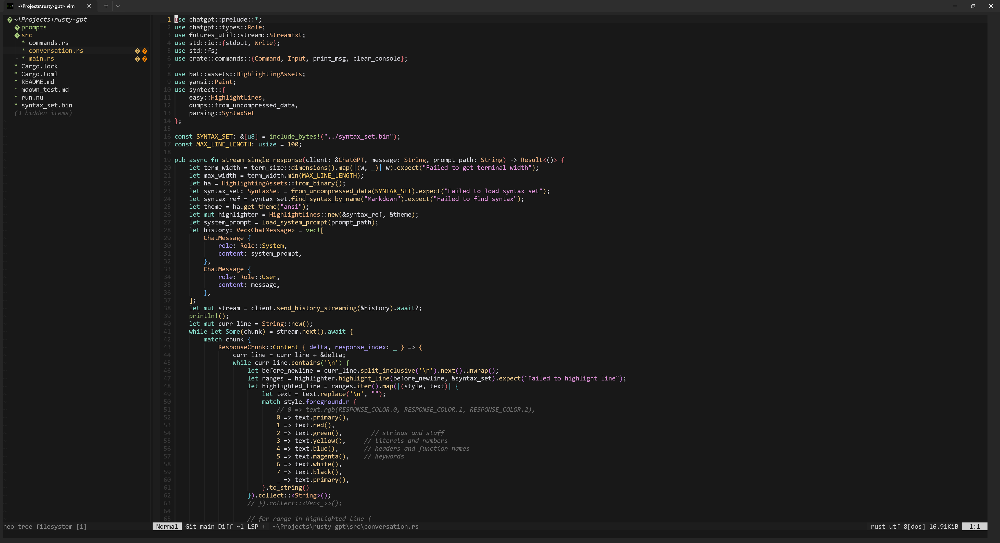

# Anysphere for Neovim

A colorscheme for Neovim inspired by the [Cursor Anysphere theme](https://github.com/hasokeric/cursor-anysphere-theme). Includes support for [treesitter](https://github.com/nvim-treesitter/nvim-treesitter) and [semantic highlights](https://neovim.io/doc/user/lsp.html#lsp-semantic-highlight).



The lua code and project structure were taken from [gruvbox.nvim](https://github.com/ellisonleao/gruvbox.nvim), including (most) available configuration options.

## Installing

### Using `packer`

```lua
use { "brendon-felix/anysphere.nvim" }
```

### Using `lazy.nvim`

```lua
{ "brendon-felix/anysphere.nvim", priority = 1000 , config = true, opts = ...}
```

### Using `vim-plug`

```vim
Plug 'brendon-felix/anysphere.nvim'
```

## Basic Usage

Inside `init.vim`

```vim
colorscheme anysphere
```

Inside `init.lua`

```lua
vim.cmd([[colorscheme anysphere]])
```

